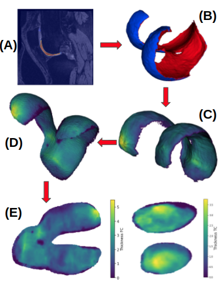

[](https://github.com/uncbiag/OAI_analysis_2/actions)
[](https://github.com/uncbiag/OAI_analysis_2/actions)

# OAI Analysis 2

This repository contains open-source analysis approaches for the [Osteoarthritis Initiative (OAI)](https://nda.nih.gov/oai/) magnetic resonance image (MRI) data.
The analysis code is largely written in Python with the help of [ITK](http://itk.org) and [VTK](http://vtk.org) for data I/O and mesh processing
as well as [PyTorch](http://pytorch.org) for the deep learning approaches for segmentation and registration. The intial development of this work
was led by [UNC Chapel Hill](http://biag.cs.unc.edu) as well as [Kitware](http://kitware.com). This work is also an outgrowth of conversations within the
[Community for Open and Reproducible Musculoskeletal Imaging Research (JC|MSK)](https://jcmsk.github.io/). Going forward, contributions by the 
broader community are, of course, not only welcome but encouraged.

The following functionality is currently supported:
1. **Deep Learning Segmentation**: Automatic cartilage segmentation (femoral and tibial cartilage) using a 3D UNet.
2. **Cartilage thickness**: Extraction of femoral and tibial cartilage meshes and measuring of cartilage thickness based on a closest-point thickness estimation.
3. **Deep Learning Atlas registration**: Registration of the carilage meshes with associated cartilage thickness to a knee atlas space via a deep registration network.
4. **2D thickness mapping**: Mapping of the thickness maps to a common 2D atlas space which provides full spatial correspondence. This is achieved via unrolling (based on a cylindrical coordinate system) for the femoral cartilage and a planar projection for the tibial cartilage.
5. **Statistical analysis**: [Longitudinal statistical analysis approaches will be added shortly]



### Difference between OAI Analysis and OAI Analysis 2

The analysis approaches in this repository are based on our initial [OAI Analysis](https://github.com/uncbiag/OAI_analysis) work.
Much of the functionality of the original code-base has been ported to the *OAI Analysis 2* repository. The main differences are
1. **Refactoring**: A significant refactoring of the code so that it makes better use of [ITK](http://itk.org) conventions as well as [VTK](http://vtk.org) for all the mesh processing needs.
2. **ICON registration**: We switched to the new [ICON](https://github.com/uncbiag/ICON) registration approach (see manuscripts below).
3. **Data processing**: We improved the data processing by better handling of data objects. Whereas the previous *OAI Analysis* pipeline largely depended on reading and writing various different files, the *OAI Aanalysis 2* refactoring uses ITK and VTK objects.
4. **Jupyter notebooks**: Better support of analysis in Jupyter notebooks.

We are currently working on the following features which should be available in the near future:
1. **Distributed processing**: Whereas *OAI Analysis* was set up for cluster computing via a simple SLURM script OAI Analysis 2 is moving toward using [Dask](https://dask.org/) to allow for parallel processing on clusters and the cloud.
2. **Workflow management**: Whereas *OAI Analysis* used custom code to avoid recomputing results, we are switching to [Dagster](https://dagster.io/) to manage data dependencies in *OAI Analysis 2*.
3. **Distribution of analysis results**: As we are planning on not only distributing code, but also analysis results (such as segmentations, meshes, thickness maps) we are planning on supporting data access via the [Interplanetary File System (IPFS)](https://ipfs.io/).

### Installation of dependencies and testing

```
git clone https://github.com/uncbiag/oai_analysis_2
cd oai_analysis_2
mamba env create --file environment.yml
conda activate oai-analysis-2
# todo: need to test this
pip install -e .
python -m unittest -v discover
```

Currently, this should declare that the segmentation test passed, and the registration test failed.

To view the demo notebooks:
```
cd notebooks
jupyter notebook
```

upload test data to https://data.kitware.com/#collection/6205586c4acac99f42957ac3/folder/620559344acac99f42957d63

### Distributed computation in the Cloud

```sh
mamba env create --file environment.yml
conda activate oai-analysis-2
./create_coiled_environment.py
jupyter lab ./notebooks/DaskComputationCoiled.ipynb
```


### Related manuscripts

While we used the following stationary velocity field registration approach available in [easyReg](https://github.com/uncbiag/easyreg) for *OAI Analysis*
[[paper]](https://biag.cs.unc.edu/publication/dblp-confcvpr-shen-hxn-19/)
```
@InProceedings{Shen_2019_CVPR,
title={Networks for joint affine and non-parametric image registration},
author={Shen, Zhengyang and Han, Xu and Xu, Zhenlin and Niethammer, Marc},
booktitle={Proceedings of the IEEE/CVF Conference on Computer Vision and Pattern Recognition},
pages={4224--4233},
year={2019}
}
```

we now support the [ICON](https://github.com/uncbiag/ICON) registration approach which provides a very simple registration interface and makes use of ITK images and transforms:
[[paper]](https://biag.cs.unc.edu/publication/dblp-journalscorrabs-2105-04459/)
```
@InProceedings{Greer_2021_ICCV,
author    = {Greer, Hastings and Kwitt, Roland and Vialard, Francois-Xavier and Niethammer, Marc},
title     = {ICON: Learning Regular Maps Through Inverse Consistency},
booktitle = {Proceedings of the IEEE/CVF International Conference on Computer Vision (ICCV)},
month     = {October},
year      = {2021},
pages     = {3396-3405}
}
```

An overview of the current analysis framework will be available as a [QMSKI](https://qmski.org/) abstract
```
@InProceedings{Sahu_2022_QMSKI,
author    = {Sahu, Pranjal and Greer, Hastings and Xu, Zhenlin and Shen, Zhengyang and Bonaretti, Serena and McCormick, Matt and Niethammer, Marc},3
title     = {Reproducible Workflow for Visualization and Analysis of OsteoArthritis Abnormality Progression},
booktitle = {Proceedings of the International Workshop on Quantitative Musculoskeletal Imaging (QMSKI)},
year      = {2022}
}
```

Results obtained by the *OAI Analysis* pipeline can be found in this manuscript
[[paper]](https://www.sciencedirect.com/science/article/pii/S1361841521003881?casa_token=Pgx9BQD4H_4AAAAA:P91yIWLkxXp_ZzLURL7LGSyrdqFJ-QARRTKSq5IoyQ8uGHUc221-hWNoL8ObpvQuls1JBZ4)
```
@article{huang2022dadp,
  title={DADP: Dynamic abnormality detection and progression for longitudinal knee magnetic resonance images from the Osteoarthritis Initiative},
  author={Huang, Chao and Xu, Zhenlin and Shen, Zhengyang and Luo, Tianyou and Li, Tengfei and Nissman, Daniel and Nelson, Amanda and Golightly, Yvonne and Niethammer, Marc and Zhu, Hongtu},
  journal={Medical Image Analysis},
  pages={102343},
  year={2022},
  publisher={Elsevier}
}
```

### Acknowledgements

This work was developed with support in part from the National Institute of Arthritis and Musculoskeletal and Skin Diseases (NIAMS) 
under award numbers [1R44AR074375](https://reporter.nih.gov/search/Naf5qSR3eUStFkMfGm6KpQ/project-details/9777582) and [1R01AR072013](https://reporter.nih.gov/search/eE7eB34dVUGoY1nLF3kZNA/project-details/9368542).
